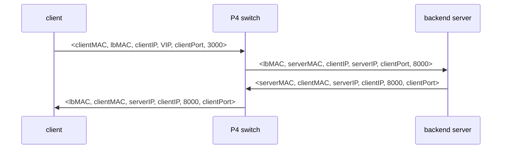

# L4 Connection-Aware Load Balancer
This is a simple implementation of a Layer 4 (L4) connection-aware load balancer using a P4 switch. The load balancer accepts connections from a client host and maps them to different backend servers based on their IP and port. Backend server information is provided from the controller as table.

## Load Balancer Functionality
The load balancer implemented in this project performs the following tasks:
1. Rewrites the destination Virtual IP (VIP) address and Virtual TCP port with the real addresses of the backend server.
2. Keeps track of existing connections and assigns the same backend server to the same connection to preserve connection consistency.
3. Sends new connections to the backend server with the least number of active connections.
4. Detects when TCP connections are closed and decreases the associated connection counter.

An hash table is used to keep track of the already assigned connections (hash arguments are client IP and VIP addresses, and both source and destination TCP ports). However, due to hash collisions, it is important to note that the load balancer might not guarantee a perfect balance among the backend servers (a new colliding flow is recognized as an already assigned one) especially with a large amount of flows.

Only TCP segments are handled by the switch.
